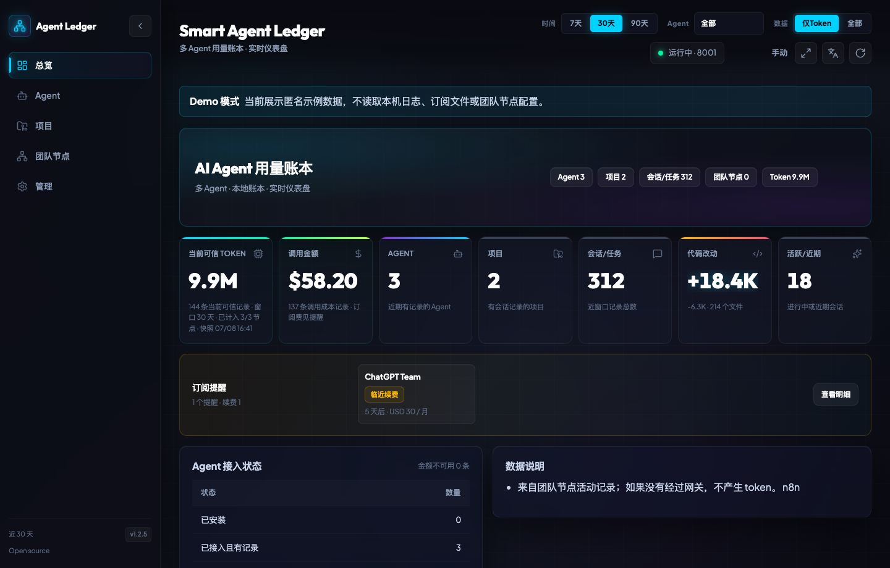

# Smart Agent Ledger

> **Local-first AI agent usage ledger for developers and small teams**
>
> An open-source dashboard for tracking tokens, costs, subscriptions, projects, and team-node usage across AI coding tools such as Codex, Claude Code, Cursor, Trae, Hermes, OpenClaw, and LiteLLM.
>
> Created and maintained by **Chuluu**.

[中文说明](README.zh-CN.md) | English

[](#why-this-exists)
[](./pyproject.toml)
[](https://fastapi.tiangolo.com/)
[](./TESTING.md)
[](./LICENSE)
[](./SECURITY.md)

[Demo Quick Start](#3-minute-quick-start) | [Testing Matrix](./TESTING.md) | [Security Notes](./SECURITY.md) | [Open Source Readiness](./OPEN_SOURCE_READINESS.md)



---

## Why This Exists

AI coding work is increasingly split across multiple tools. Codex may keep one ledger, Claude Code another, Cursor may expose only metadata, and some tools have no useful cost view at all. That makes it hard to answer basic operational questions:

- How many tokens did the team use this week?
- Which projects or agents are driving cost?
- Which numbers are real, estimated, stale, or metadata-only?
- Which subscriptions are close to renewal or quota pressure?
- Which machines are connected, stale, or missing from the team view?

**Smart Agent Ledger** focuses on one job: make AI-agent usage visible and trustworthy without sending local logs to a hosted service.

It also includes an optional lightweight OpenAI-compatible gateway, but the public product is primarily a local-first usage ledger.

---

## 3-Minute Quick Start

Run the dashboard with anonymous sample data. Demo mode does not read local AI tool logs, subscription files, API keys, or team-node configuration.

```bash
git clone https://github.com/ChuluuMGL/Smart-Agent-Ledger.git
cd Smart-Agent-Ledger
python3 -m venv venv
source venv/bin/activate
pip install -U pip
pip install -r requirements.txt
SMART_AGENT_LEDGER_DEMO_MODE=1 uvicorn gateway:app --host 127.0.0.1 --port 8001 --no-access-log
open http://127.0.0.1:8001/ui
```

Production-like local run:

```bash
cp keys.env.example keys.env
chmod 600 keys.env
./run.sh
```

Docker:

```bash
docker build -t smart-agent-ledger .
docker run -p 8001:8001 -v "$PWD/data:/app/data" smart-agent-ledger
```

---

## What It Does

| Capability | What It Provides |
|---|---|
| Local agent ledger | Reads local JSONL, SQLite, logs, and event files from AI coding tools. |
| Token confidence | Separates real token counts, estimates, metadata-only rows, stale rows, and missing data. |
| Cost estimation | Uses `data/model-pricing.json` to estimate cost when model and token counts are available. |
| Project attribution | Groups sessions by project, path, alias, workflow name, or request metadata. |
| Team-node rollup | Aggregates multiple machines through HTTP collectors or shared ledger files. |
| Subscription reminders | Tracks renewal windows, quota pressure, and reminder status. |
| Demo mode | Shows an anonymized dashboard without touching local usage data. |
| Optional gateway | Provides OpenAI-compatible proxy endpoints, keyword routing, fallback chains, and request metering. |

---

## Data Sources

| Agent / Source | Data Source | Token Quality |
|---|---|---|
| OpenAI Codex | Session JSONL and token-count events | Real |
| Claude Code | Session JSONL `message.usage` records | Real |
| Hermes | SQLite `state.db` | Real |
| OpenClaw | Session index JSON | Real |
| LiteLLM | PostgreSQL SpendLogs, when configured | Real |
| Trae | Git snapshot tags and turn estimation | Estimated |
| Antigravity | `cloudcode.log` heartbeat analysis | Estimated |
| Cursor | `workspaceStorage` metadata | Metadata only |
| n8n | SQLite workflow execution data through optional SSH | Activity only |

The dashboard is intentionally conservative: records without trustworthy token data do not silently become `0`, and stale team-node snapshots are marked as stale.

---

## Product Workflow

| Step | Purpose | Output |
|---|---|---|
| 1. Collect | Read local tool ledgers and optional gateway events. | Raw sessions and activity rows. |
| 2. Normalize | Convert source-specific fields into a common session model. | Agent, project, task, model, tokens, cost, timestamps. |
| 3. Score quality | Mark rows as real, estimated, stale, metadata-only, or unavailable. | Trustworthy KPI inputs. |
| 4. Aggregate | Build agent, project, model, task, timeline, and team-node summaries. | Dashboard and JSON API responses. |
| 5. Explain | Surface missing sources, stale collectors, and token-quality notes. | Operator-facing diagnostics. |
| 6. Report | Export monthly usage summaries and subscription reminders. | Local Markdown reports and alert payloads. |

This workflow is designed for operational truth rather than vanity metrics. If a number is incomplete, the product should say why.

---

## Work Modes

| Mode | When To Use | Behavior |
|---|---|---|
| `demo` | First-time evaluation, README screenshots, public demos. | Uses anonymous sample data only. |
| `local` | Single developer machine. | Reads local agent ledgers and local config. |
| `team` | Multiple trusted machines. | Pulls collector nodes and marks stale or unavailable sources. |
| `gateway` | Optional API proxy and request metering. | Records OpenAI-compatible requests and provider fallback events. |
| `reporting` | Monthly or operational review. | Generates local usage reports and subscription reminders. |

---

## API Surface

| Endpoint | Method | Description |
|---|---|---|
| `/ui` | GET | Single-page dashboard. |
| `/health` | GET | Service health check. |
| `/agent-ledger` | GET | Local multi-agent usage ledger. |
| `/fleet-ledger` | GET | Team-node aggregate ledger. |
| `/subscription-ledger` | GET | Subscription renewal and quota status. |
| `/reports/monthly-usage` | POST | Local Markdown usage report. |
| `/config` | GET | Routing and keyword configuration. |
| `/stats` | GET | Gateway request counters. |
| `/v1/models` | GET | OpenAI-compatible model list. |
| `/v1/chat/completions` | POST | Optional OpenAI-compatible chat proxy. |
| `/v1/chat/completions/dry-run` | POST | Route diagnosis without forwarding. |

All endpoints return JSON except `/ui`.

---

## Configuration Files

Runtime config lives in `data/` and is ignored by git. Safe examples are included.

| File | Purpose | Example |
|---|---|---|
| `keys.env` | Provider keys and API auth key. | `keys.env.example` |
| `model-pricing.json` | Model pricing table for cost estimation. | Included |
| `routing-keywords.json` | Optional keyword routing rules. | Included |
| `model-subscriptions.json` | Subscription quota and renewal tracking. | `model-subscriptions.example.json` |
| `company-agent-nodes.json` | Team-node endpoints and optional n8n SSH sources. | `company-agent-nodes.example.json` |
| `feishu-reminder.json` | Feishu/Lark alert configuration. | `feishu-reminder.example.json` |
| `project-aliases.json` | Project attribution aliases. | `project-aliases.example.json` |

`company-agent-nodes.json` is a legacy-compatible file name. The product UI and docs refer to these as **team nodes**.

---

## Included Files

| File / Folder | Purpose |
|---|---|
| [`gateway.py`](./gateway.py) | FastAPI app, dashboard routes, optional gateway endpoints, cache orchestration. |
| [`agent_ledger.py`](./agent_ledger.py) | Local agent collector orchestration and ledger summary builder. |
| [`agent_collectors.py`](./agent_collectors.py) | Source-specific collectors for AI coding tools and gateway events. |
| [`agent_ledger_server.py`](./agent_ledger_server.py) | Read-only collector service for team nodes. |
| [`fleet_ledger.py`](./fleet_ledger.py) | Team-node aggregation, stale-cache handling, n8n activity collection. |
| [`subscription_ledger.py`](./subscription_ledger.py) | Subscription and quota ledger. |
| [`usage_report.py`](./usage_report.py) | Local monthly usage report generation. |
| [`feishu_notifier.py`](./feishu_notifier.py) | Feishu/Lark reminder payloads and alert sending. |
| [`static/`](./static/) | Dashboard HTML, CSS, and JavaScript. |
| [`data/`](./data/) | Safe example configs and pricing/routing tables. |
| [`tests/`](./tests/) | Unit and API behavior tests. |
| [`TESTING.md`](./TESTING.md) | Runtime and release testing matrix. |
| [`SECURITY.md`](./SECURITY.md) | Security boundary and sensitive-file guidance. |
| [`OPEN_SOURCE_READINESS.md`](./OPEN_SOURCE_READINESS.md) | Public/private repository separation checklist. |

---

## Testing

```bash
pip install -r requirements.txt
pip install pytest
python -m pytest -q
node --check static/dashboard.js
git diff --check
```

Current public release check:

```text
412 passed
```

See [`TESTING.md`](./TESTING.md) for the test matrix and recommended smoke tests.

---

## One-Line Collector Onboarding

On a new trusted Mac, install the read-only collector and register it with your main gateway:

```bash
/bin/bash -c "$(curl -fsSL https://raw.githubusercontent.com/ChuluuMGL/Smart-Agent-Ledger/main/deploy/bootstrap-collector-node.sh)" -- --main http://<mac-mini-tailscale-ip>:8001 --name "$(hostname -s)"
```

Add `--api-key <main-gateway-api-key>` if your main gateway protects `/admin/nodes`.

The bootstrap script clones this repository into `~/.smart-agent-ledger/app`, installs the collector-only `8002` service, detects LAN and Tailscale URLs, and registers the node when `--main` is provided.

---

## Security

Smart Agent Ledger reads local AI tool logs and can expose usage summaries over HTTP. Keep it on localhost, a trusted LAN, or a VPN unless you add your own authentication and network controls.

Do not commit:

- `keys.env`, `.env`, `.secrets/*`
- `data/company-agent-nodes.json`
- `data/model-subscriptions.json`
- `data/feishu-reminder.json`
- `data/fleet-exports/*`
- runtime logs, local cache files, or private machine paths

Do not expose ports `8001` or `8002` directly to the public internet.

See [`SECURITY.md`](./SECURITY.md) for details.

---

## Roadmap

| Priority | Item | Why It Matters |
|---|---|---|
| P0 | Clearer data-trust labels in every KPI. | Prevents users from mistaking stale or partial totals for current truth. |
| P0 | One-command collector install for new machines. | Included as `deploy/bootstrap-collector-node.sh`; needs more real-machine feedback. |
| P1 | Daily rollups for very large local ledgers. | Keeps 30/90-day switching fast on long-running machines. |
| P1 | Public demo screenshots and short walkthrough GIF. | Improves open-source trust and adoption. |
| P2 | Optional OpenTelemetry or Prometheus export. | Lets teams integrate with existing observability stacks. |
| P2 | Hosted docs site. | Makes setup and troubleshooting easier than a single README. |

---

## License

This project is licensed under the **GNU Affero General Public License v3.0**.

See [`LICENSE`](./LICENSE) for the full license text.

---

## Author

Created and maintained by **Chuluu**.

- GitHub: [ChuluuMGL](https://github.com/ChuluuMGL)
- Notice: [`NOTICE`](./NOTICE)

---

## Acknowledgments

Built with [FastAPI](https://fastapi.tiangolo.com/), [uvicorn](https://www.uvicorn.org/), and [httpx](https://www.python-httpx.org/).
